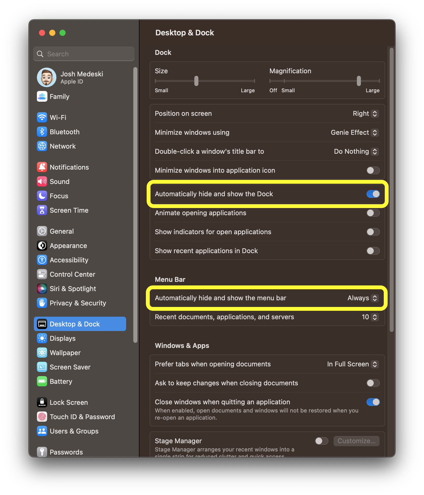

I have a minimal, clutter-free, setup on my macOS environment, using tools like tmux and Vim. I have customized my settings to hide the dock and menu bar, and I prefer to use keyboard shortcuts rather than menu items. I also use a window manager and a transparent border for my terminal. I find this setup to be peaceful and conducive to focus, as it removes distractions and allows me to be more productive.

The two most helpful settings for making macOS clutter free are in the "Desktop & Dock" settings in macOS Ventura.

