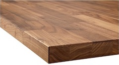
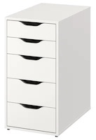
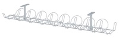
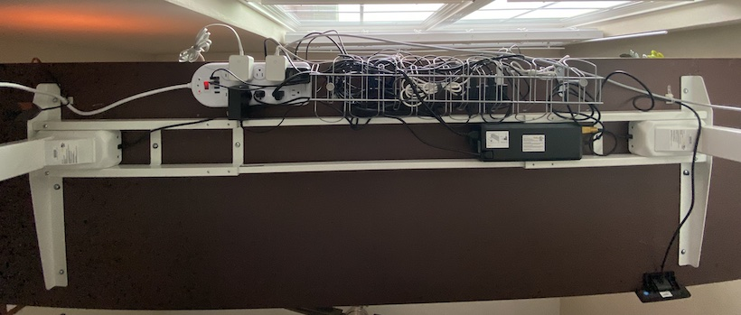
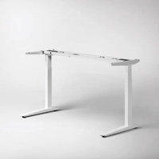
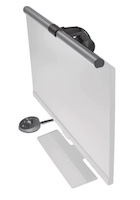
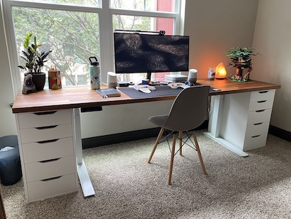

Standing desks have gained a lot of popularity in the last few years. At a previous job, I had a nice standing desk from [Herman Miller](https://www.hermanmiller.com). Unfortunately, it was very expensive which is something I couldn't afford for my home. So, I built an IKEA hack standing desk.

The office at my previous house was recently featured on [ZSA's people blog](https://people.zsa.io/josh-medeski/). Since then, I took it one step further and converted it into a standing desk. After lots of research, including helping a friend set up a standing desk of her own, I chose what would work best for me.

Thankfully, [IKEA](https://www.ikea.com/) offers quality products at an affordable rate and people all over the internet have found [clever ways](https://www.ikeahackers.net) to mix and match IKEA's products to build custom, unique, solutions.

Here were my criteria for how to make an IKEA hack standing desk:

1. Lots of counter space
2. Lots of storage
3. Doesn't break the bank
4. Looks good
5. Can be customized in the future

I'll go through each piece of my setup, give you some tips, and explain how to make an IKEA hack standing desk.

## The Countertop

The countertop is the most important element of a desk. It's the foundation for a good desk. That's why so many companies charge a lot for their desks: good quality material is expensive. Thankfully, a wood veneer is a great alternative. I got IKEA's [KARLBY Countertop](https://www.ikea.com/us/en/p/karlby-countertop-walnut-veneer-70335212/). It's 98 inches which is plenty wide enough space for my needs.

## Storage

The next step for a great desk is its support. When I first built it I didn't have the budget for a standing desk. I know IKEA sells [basic furniture legs](https://www.ikea.com/us/en/p/torsklint-leg-light-gray-90365458/) but, as someone who lives in apartments, I wanted good storage. I got two [ALEX Drawer units](https://www.ikea.com/us/en/p/alex-drawer-unit-white-00473546/). My long desk had plenty of room to give me comfortable legroom in the middle.

## Cable Management

Cable management is hard. There are lots of potential solutions, but I got the [SIGNUM cable management tool](https://www.ikea.com/us/en/p/signum-cable-management-horizontal-silver-color-30200253/) and a [power strip](https://www.amazon.com/dp/B08FCDWYJ1/) that I could mount to the bottom of the countertop. With some time, patience, and attention to detail, I was able to tuck everything out of sight.

All the items above make a great desk, the Alex units do a good job holding the countertop and if you're on a budget I'd recommend you stop there. I had this setup for years before I decided to upgrade to a standing desk.

## Standing Desk

I thought about getting rid of my IKEA hack and upgrading to a standing desk. I realized getting something similar (without the storage) was going to cost me almost $1000! Because everything was still in good shape, and I already liked the look of the desk, I got [Fully's Jarvis frame only](https://www.fully.com/jarvis-frame-only.html). The white frame with the Alex units made it match the setup perfectly! I'm glad I went in this direction because it was easy to install myself. I made sure to install the frame so the Alex units could still fit perfectly on the edges of the countertop.

## Accessories

There are a few accessories I recommend for lighting and comfort:

- [BenQ's Computer Monitor Light ScreenBar Plus](https://www.benq.com/en-us/lamps/computer-desklamp/screenbar-plus.html) goes on top of your monitor and gives you a bright counter space without creating a glare.
- [Steelseries's XXL mouse pad](https://steelseries.com/gaming-mousepads/qck-heavy-series?size=xxl) provides a soft surface for your mouse and keyboard.

## Tips

- I highly recommend getting the programmable memory unit so you don't have to deal with accidentally hitting the Alex drawers with the countertop.
- I also highly recommend taking the time to do cable management, for years I always had cluttered cables that were under my feet. But now that it's perfect I'm enjoying my office space even more.
- A 98" desk is a lot! You may have a hard time making it work for your floorplan. You can go with a smaller countertop and use one or no Alex units to gain extra real estate in your room.
- I chose [Fully](https://www.fully.com) over [IKEA's standing desk options](https://www.ikea.com/us/en/search/products/?q=standing%20desk) because I had multiple friends with Fully models and were very happy with it. Also, I hadn't heard anything good about IKEA's standing desk options and figured quality over cost was important for the standing desk motor.
- If I had more money, I would buy a real wood countertop. The veneer looks nice, but my parents are woodworkers and I've always appreciated the real thing. Maybe one day I'll upgrade.
- I don't recommend a permanently standing desk. I like being able to switch between sitting and standing throughout the day, it helps my brain work in different ways and sometimes I get tired of standing.
- I purposefully didn't mention what chair I use. It's just a basic kitchen table chair. If you have any suggestions please leave them in the comments.
- If there's something in the pictures you want to more about but I haven't talked about checking out my [uses page](/uses) where I discuss computers, audio equipment, and more.

### How to make an IKEA hack standing desk

- [KARLBY - Countertop (98")](https://www.ikea.com/us/en/p/karlby-countertop-walnut-veneer-70335212/)
- [ALEX - Drawer unit (x2)](https://www.ikea.com/us/en/p/alex-drawer-unit-white-00473546/)
- [Fully - Jarvis (Frame Only)](https://www.fully.com/jarvis-frame-only.html)
- [SIGNUM - Cable management](https://www.ikea.com/us/en/p/signum-cable-management-horizontal-silver-color-30200253/)
- [Amazon - Power Strip](https://www.amazon.com/dp/B08FCDWYJ1/)

## Conclusion

I'm very happy with how I made an IKEA hack standing desk. It took years of iteration before I finally got to this state and I may make more changes in the future. Hopefully, this guide was helpful and now you can make an IKEA hack standing desk of your own.

Have you built your desk? Have questions about my setup? Let me know in the comments below.
