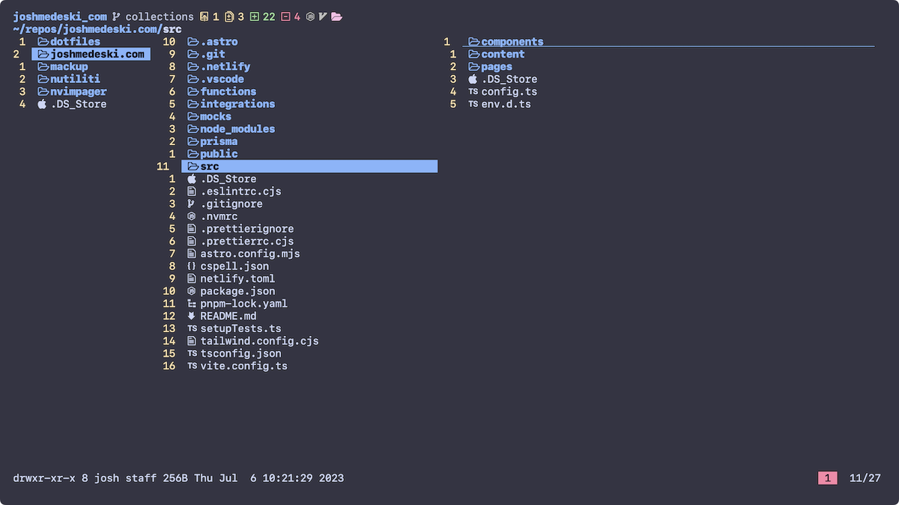
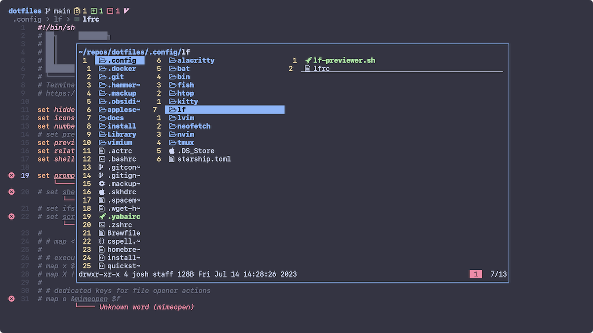

[`lf`](https://pkg.go.dev/github.com/gokcehan/lf) is a terminal file manager. Having to constantly change directories with the `cd` command and preview files with `cat` can be slow and repetitive. `lf` allows you to quickly navigate your filesystem and preview files with a single vim-like commands.

## Install

Install it homebrew with the following command.

```sh
brew install lf
```

## Using

Using `lf` is as simple as running the `lf` command which will pull up the file manager. You can use `hjkl` as arrow keys to navigate the files. You can also press `o` to open up a file in your editor.

## Configuration

`lf` is configured with a file located at `~/.config/lf`. Here are some simple default options that I like to set.

```sh title="~/.config/lf/lfrc"
set hidden
set icons
set number
set relativenumber
set shell fish
set promptfmt "\033[34;1m%d\033[0m\033[1m%f\033[0m"
```

You can add icon support by install my fish plugin:

```sh
fisher install joshmedeski/fish-lf-icons
```

Here's a preview of what it looks like:



I also like to have access to lf while inside neovim, so you can add the following plugin to your LazyVim setup.

```lua
return {
  "lmburns/lf.nvim",
  cmd = "Lf",
  dependencies = { "nvim-lua/plenary.nvim", "akinsho/toggleterm.nvim" },
  opts = {
    winblend = 0,
    highlights = { NormalFloat = { guibg = "NONE" } },
    border = "single",
    escape_quit = true,
  },
  keys = {
    { "<leader>ff", "<cmd>Lf<cr>", desc = "NeoTree" },
  },
}
```

You'll have to restart LazyVim, but after that you can press `<space>+f+f` to open lf as a floating window in the directory of the file you have open.



## Conclusion

I prefer `lf` over sidebar style file mangers and it is infinitely customizable for your needs. We discussed install it with homebrew, configuring it to show icons, and how to use it in Neovim. Check out the [lf wiki](https://github.com/gokcehan/lf/wiki) to learn how to customize it more.
