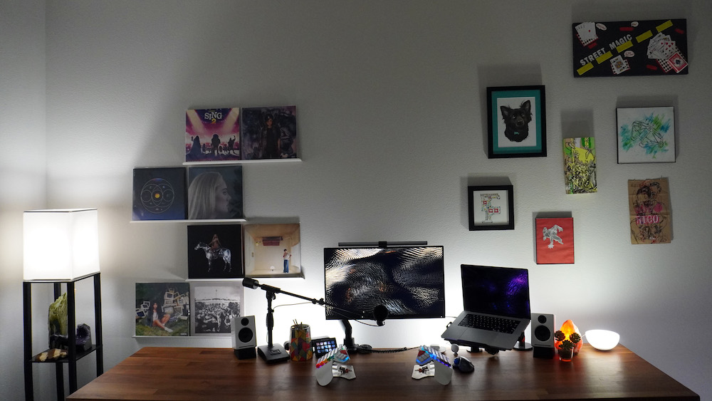

## Developer Environment

- Multiplexer: [tmux](https://github.com/tmux/tmux/wiki)
- Shell: [fish](https://fishshell.com)
- Editor: [Neovim](https://neovim.io)
- Git: [lazygit](https://github.com/jesseduffield/lazygit)
- npm package manager: [pnpm](https://pnpm.io/)
- macOS package manager: [Homebrew](https://brew.sh)
- Colors: [catppuccin](https://github.com/catppuccin/catppuccin)
- Font: [SFMono Nerd Font](https://github.com/epk/SF-Mono-Nerd-Font)

## Software

- Launcher: [Raycast](https://www.raycast.com/)
- Terminal emulator: [Wezterm](https://wezfurlong.org/wezterm/)
- Note-taking: [Obsidian](https://obsidian.md/)
- Browser: [Arc](https://arc.net/)
- Calendar: [Fantastical](https://flexibits.com/fantastical/)
- Email: [Mail](https://support.apple.com/en-gb/guide/mail/welcome/mac)
- Password manager: [1Password](https://1password.com/)
- Music: [Cider (Apple Music)](https://cider.sh/)

## Hardware

- Laptop: [MacBook Pro](https://www.apple.com/macbook-pro-14-and-16/) (16-inch, 2023, Apple M2 Max, 32GB RAM)
- Keyboard: [Moonlander](https://www.zsa.io/moonlander/)
- Mouse: Logitech trackball
- Speakers: [Audioengine A2+](https://audioengine.com/shop/wirelessspeakers/a2-wireless-computer-speakers/)
- Wireless headphones: [AirPods Max](https://www.apple.com/airpods-max/)
